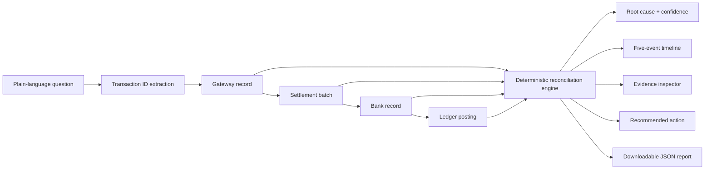

# Settlement Trace AI

Settlement Trace AI is a reconciliation command centre for payment operations teams. Ask a plain-language question such as **“Why is TXN-1048 not settled?”** and the product traces that payment across the gateway, settlement batch, bank credit, and internal ledger. It then identifies the first broken link, explains the evidence, measures the SLA impact, and recommends the next operational action.

> **Demo safety:** every record bundled with this repository is synthetic. The product never presents the sandbox as live financial data.

## Why this problem matters

When a merchant asks where a payment went, operations teams often search several disconnected systems and manually compare timestamps, amounts, settlement references, UTRs, and ledger postings. That is slow, difficult to audit, and especially painful when records disagree.

Settlement Trace AI turns that work into a reproducible investigation:



The diagnosis comes from deterministic rules, not a language model. A result can therefore be repeated, tested, and defended to an auditor.

## Product highlights

- Natural-language transaction investigation with direct demo-case shortcuts
- Interactive 3D trace across payment gateway, settlement, bank, and ledger
- Clear first-break detection, exception flags, confidence score, and recommended action
- Five-event timeline covering capture, batching, processing, credit, and posting
- Structured evidence tabs that make missing records visible instead of inventing them
- SLA elapsed/remaining or overdue calculations based on the captured timestamp
- Operations dashboard with status distribution, break-stage analysis, and recent cases
- Validated CSV replacement for synthetic gateway, bank, and ledger data
- Downloadable JSON investigation report and print-ready view
- Accessible reduced-motion, low-power, mobile, and WebGL fallbacks
- Page-level `investigate_transaction` WebMCP tool that updates the same visible investigation

## Included investigation scenarios

| Transaction | Scenario | Expected classification |
| --- | --- | --- |
| `TXN-1001` | All four records reconcile | Successful |
| `TXN-1048` | Captured but never added to a settlement | Delayed |
| `TXN-1023` | Settlement batch still processing inside SLA | Pending |
| `TXN-1055` | Settlement processed; bank credit pending | Pending |
| `TXN-1062` | Bank credited; ledger posting missing | Delayed |
| `TXN-1071` | Settlement batch failed | Failed |
| `TXN-1080` | Settlement amount differs from gateway | Mismatch |
| `TXN-1088` | Bank UTR conflicts with settlement UTR | Mismatch |
| `TXN-1090` | Duplicate internal ledger postings | Mismatch |
| `TXN-1097` | Bank reports failure while ledger reports posted | Uncertain |
| `TXN-1102` | Capture timestamp is unavailable | Uncertain |

Unknown IDs are reported as insufficient evidence; the application does not fabricate a payment history.

## How the reconciliation works

1. Normalize the transaction ID from a question or direct input.
2. Join records using transaction, settlement, gateway, and bank references.
3. Compare stage status, amount, reference, and chronology.
4. Stop at the earliest confirmed break or mismatch.
5. Lower confidence when evidence is incomplete or contradictory.
6. Produce an explanation, exception list, SLA assessment, and action grounded in the joined records.

The rule engine is isolated in `lib/reconciliation.ts`, while the synthetic source records live in `lib/sandbox-data.ts`. This separation keeps the business logic testable and makes a real connector layer straightforward to add later.

## Run locally

Requirements: Node.js 22.13 or newer and pnpm.

```bash
pnpm install
pnpm dev
```

Open `http://localhost:3000`.

To validate a production build:

```bash
pnpm typecheck
pnpm lint
pnpm test
pnpm build
```

The current suite contains 15 deterministic tests covering the investigation rules and CSV validation.

## Try your own synthetic CSVs

The Data tab accepts CSV files for gateway, bank, and ledger sources. Start with the files in `examples/`. Each file is parsed and validated before it replaces that source in the in-browser sandbox.

Do not upload production payment data to the public demo. The importer is a hackathon sandbox and does not send CSV contents to a purpose-built financial data backend.

## Architecture and stack

- Vinext, React 19, and TypeScript
- React Three Fiber, Drei, and Three.js for the 3D trace
- Recharts for operational summaries
- Papa Parse for guarded CSV import
- Vitest for deterministic unit tests
- Cloudflare-compatible Worker output for deployment

The app is intentionally client-side and serverless for the hackathon demo. A production version would add authenticated bank/gateway connectors, encrypted storage, role-based access, immutable audit logs, and environment-specific retention controls.

## Project map

```text
app/                         Application entry and visual system
components/                  Investigation, 3D, timeline, evidence, dashboard, CSV UI
lib/reconciliation.ts       Deterministic diagnosis engine
lib/sandbox-data.ts         Clearly labelled synthetic dataset
lib/csv-import.ts            CSV parsing and validation
examples/                    Sample synthetic CSV inputs
types/webmcp.d.ts            Progressive WebMCP browser typing
```

## Live demo

The validated production release is available at [Settlement Trace AI](https://settlement-trace-ai.nikhilgurnani0524.chatgpt.site).

The repository is also ready for Vercel. After authenticating the Vercel CLI, deploy from the project root with `vercel --prod`.

## Screenshots and demo flow

For a 90-second judge walkthrough:

1. Open `TXN-1001` to establish the healthy reference path.
2. Ask “Why is TXN-1048 not settled?” to show the first missing record and overdue SLA.
3. Open `TXN-1097` to demonstrate uncertainty instead of an invented confident answer.
4. Switch through the timeline and evidence tabs, then download the JSON report.
5. Finish on Operations to show portfolio-level prioritisation.

The concise six-slide pitch is available at [deliverables/Settlement_Trace_AI_Hackathon_Pitch.pptx](deliverables/Settlement_Trace_AI_Hackathon_Pitch.pptx).

## Originality and responsible use

The product design, rule engine, synthetic cases, 3D scene, and copy in this repository were created specifically for the Origin hackathon project. External libraries are identified in [ATTRIBUTIONS.md](ATTRIBUTIONS.md). No proprietary financial records, copied project code, or paid visual assets are included.

This prototype supports investigation; it must not be treated as a banking system of record or used to make financial decisions without human review.

## License

MIT — see [LICENSE](LICENSE).
