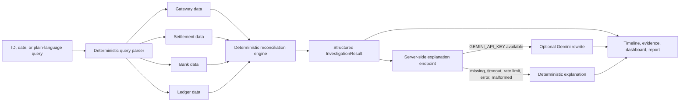

# Settlement Trace AI

Settlement Trace AI is an evidence-grounded investigation workspace for payment operations teams. It traces a transaction through the payment gateway, settlement processor, bank, and merchant ledger; identifies the first reliable break; explains the evidence; and recommends a support action.

> **Simulated-data disclaimer:** every transaction, merchant, amount, timestamp, and reference bundled with this repository is synthetic. Do not upload live financial or personal data to the public demo.

## Problem statement

When a merchant asks why a payment has not settled, a support agent typically compares disconnected gateway, settlement, bank, and ledger records by hand. Missing events, mismatched references, contradictory statuses, and invalid timestamps make that process slow and difficult to audit. Settlement Trace AI turns the investigation into a repeatable, testable workflow without making a language model the system of record.

## Architecture



The deterministic engine in `lib/reconciliation.ts` is the source of truth. The optional AI layer receives only a whitelisted structured result: status, current stage, root cause, confidence, evidence summary, exceptions, recommended action, timestamps, and SLA fields. It cannot change the classification or invent transaction facts.

## Product capabilities

- Transaction investigation by direct ID or a question such as “Why is TXN-1048 pending?”
- Date search for ISO and common English formats, including “3 September 2026,” “September 3,” and “today”
- Deterministic filters for successful, pending, delayed, failed, mismatch, and uncertain cases
- Clickable result lists that open the full investigation flow
- Cross-source validation for transaction ID, settlement ID, gateway reference, bank/UTR reference, merchant, amount, and currency
- Duplicate settlement, bank, and ledger detection
- Explicit chronology validation; negative stage durations are preserved and reported instead of clamped
- Explainable, centralized confidence deductions
- Optional server-side Gemini explanations with a complete deterministic fallback
- Synchronized 3D pipeline, five-event timeline, and evidence inspector
- Light, dark, and system themes with persistence and theme-aware charts/3D materials
- Reduced-motion, constrained-device, mobile, and WebGL fallbacks
- Validated CSV replacement for gateway, settlement, bank, and ledger sources
- Downloadable JSON investigation report and print-optimized report view
- Operations dashboard with drill-down metrics, status/anomaly distribution, latency, and recent cases
- Page-level `investigate_transaction` WebMCP tool that updates the same visible result

## Reconciliation and hallucination control

The engine joins related records by multiple available references so that it can still expose an ID conflict instead of losing the conflicting record. It then validates evidence before classifying the transaction.

Chronology checks include:

- settlement created before payment capture
- settlement processed before settlement creation
- bank credit before settlement processing
- ledger posting before bank credit
- any negative stage duration

Reference checks include:

- gateway transaction ID → settlement transaction ID
- settlement ID → bank and ledger settlement IDs
- gateway reference → settlement gateway reference
- bank reference or UTR → ledger reference when present
- merchant ID, currency, and amount consistency across systems
- duplicate records at each downstream source

The LLM never parses dates, routes a basic query, selects a status, calculates an SLA, or determines a transaction fact. If Gemini is unavailable, the user immediately sees the existing deterministic explanation, accurately labelled as such.

## Confidence logic

Every result starts at 99%. Centralized deductions are applied once per issue type and stage: missing sources reduce confidence by 12–70 points depending on importance; field conflicts by 20–28; duplicates by 25; chronology conflicts by 35; contradictory status evidence by 50; and lower-severity ambiguity by 8. The score never falls below 5%.

The UI shows each deduction next to the score. A high confidence value means that evidence is complete and internally consistent—not that an AI model felt certain.

## Included demo cases

| Transaction | Scenario | Expected classification |
| --- | --- | --- |
| `TXN-1001` | All four sources reconcile | Successful |
| `TXN-1048` | Captured but never batched | Delayed |
| `TXN-1023` | Settlement still processing inside SLA | Pending |
| `TXN-1055` | Settlement processed; bank credit pending | Pending |
| `TXN-1062` | Bank credited; ledger posting missing | Delayed |
| `TXN-1071` | Settlement batch failed | Failed |
| `TXN-1080` | Gateway and settlement amounts disagree | Mismatch |
| `TXN-1088` | Settlement and bank UTRs disagree | Mismatch |
| `TXN-1090` | Duplicate ledger postings | Mismatch |
| `TXN-1097` | Bank failure conflicts with a ledger post | Uncertain |
| `TXN-1102` | Capture timestamp unavailable | Uncertain |

`TXN-1001`, `TXN-1071`, and `TXN-1080` use archived synthetic timestamps on 3 September 2026 so the date-investigation examples remain reproducible. The other cases are generated relative to the sandbox session to preserve SLA demonstrations.

## Local development

Requirements: Node.js 22.13+ and pnpm.

```bash
pnpm install
pnpm dev
```

Open `http://localhost:3000`.

The AI layer is optional. Copy `.env.example` to `.env.local` and add a Gemini key only when you want AI-assisted wording:

```text
GEMINI_API_KEY=your_server_side_key
GEMINI_MODEL=gemini-2.5-flash-lite
```

The key is read only by `app/api/explain/route.ts`; it is never included in client code. Without it, all product flows continue to work using deterministic wording.

## CSV sandbox

The Data Lab accepts gateway, settlement, bank, and ledger CSV files. Validation covers required columns, source-specific status values, positive numeric amounts, valid ISO timestamps, transaction and settlement ID formats, required references, and duplicate primary IDs. All rows are validated before a source is replaced, and row-level issues are shown without exposing stack traces.

Example inputs are in `examples/`. Use **Reset demo data** to recover the original sandbox at any time.

## Validation

```bash
pnpm test
pnpm typecheck
pnpm lint
pnpm build
pnpm test:e2e
```

The Vitest suite covers original scenarios plus chronology conflicts, reference/merchant/currency mismatches, missing and contradictory evidence, confidence deductions, date/filter parsing, CSV recovery, and deterministic AI fallback. The Playwright suite uses behavior assertions—not screenshot-only checks—for successful/delayed/uncertain investigation, synchronized evidence selection, theme persistence, date drill-down, valid and invalid CSVs, unknown IDs, and no-key fallback.

## Deployment

The single supported deployment path is the existing Vinext → Cloudflare Worker pipeline managed by OpenAI Sites. `vite.config.ts` includes both the Cloudflare and Sites plugins, and `.openai/hosting.json` holds the Sites project association.

Before publishing, run all validation commands above. Environment secrets such as `GEMINI_API_KEY` must be configured in the deployment environment; never commit them. This repository intentionally does not include Vercel instructions because that target is not part of the verified build path.

## Project map

```text
app/api/explain/route.ts        Server-only grounded AI endpoint
components/                    Investigation, themes, 3D, timeline, evidence, dashboard, CSV UI
lib/reconciliation.ts          Deterministic source-of-truth engine and confidence scoring
lib/query-parser.ts            Deterministic ID/date/status routing
lib/ai-explanation.ts          Gemini boundary, validation, timeout, and fallback
lib/sandbox-data.ts            Clearly labelled synthetic scenarios
lib/csv-import.ts              Guarded multi-source CSV importer
lib/*.test.ts                  Unit and integration logic tests
tests/e2e/                     Playwright browser flows
examples/                      Synthetic CSV examples
deliverables/                  Brief hackathon presentation
```

## Judge walkthrough

1. Open `TXN-1001` to establish the healthy path.
2. Ask “Why is TXN-1048 pending?” to show deterministic routing, missing evidence, SLA impact, and fallback-safe explanation.
3. Search “Show failed transactions from September 3” and open `TXN-1071`.
4. Open `TXN-1097` to demonstrate honest uncertainty instead of fabricated certainty.
5. Select Bank in the 3D pipeline or timeline and show the synchronized evidence panel.
6. Switch light/dark mode, import a synthetic CSV, download the report, and finish on Operations.

The six-slide pitch is at [deliverables/Settlement_Trace_AI_Hackathon_Pitch.pptx](deliverables/Settlement_Trace_AI_Hackathon_Pitch.pptx).

## Originality and responsible use

The product design, reconciliation rules, synthetic data, motion system, 3D scene, and copy were created for this hackathon project. External libraries are listed in [ATTRIBUTIONS.md](ATTRIBUTIONS.md). This prototype supports human investigation; it is not a banking system of record and must not independently trigger financial decisions.

## License

MIT — see [LICENSE](LICENSE).
